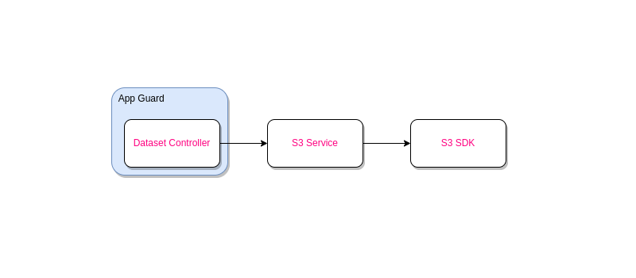

# EDNA

Dataset management microservice for ML model training

## Features

- Data upload/download/delete
- Data labeling

## Tech Stack

- NestJS
- Localstack

## Infrastructure

- **Auth0** - Issues JWT to authenticated users / applications
- **API Gateway** - Secures the API by verifying the JWT and provides throttling and rate-limiting
- **App Runner / ECS** - container orchestration and hosting for our API
- **ECR** - container image repository
- **S3** - data + label storage
- **ElasticSearch** - image indexing/searching
- **CloudWatch** - API activity logging

As it centers around blob storage, S3 pretty much powers the essential features of this API. Incidentally, S3 also support object tagging, which we will use to full effect. We will offload uploads and downloads to S3 using pre-signed URLs. This allows the consumer to upload directly to S3, which should be faster. We also avoid having to maintain TCP connections and buffer streams in our API container minimizing resource usage.  

Securing the API can be configured using API Gateway. API Gateway will decode and verify the JWT token then pass it along to our API. We can implement user activity logging simply by hooking up API Gateway to Cloudwatch. Alternatively, as the JWT token is available to our API, we can extract user information and apply application-specific restrictions.

To power search functionality, we can leverage ElasticSearch or some other database (RDS, MongoDB) to store indexes. We'd like S3 to remain the single source of truth. Lambda triggers allow us to be notified of any S3 activities / changes especially so that uploads are direct.

## Continuous Deployment

All endpoint implementations are stateless and fast allowing for zero downtime between deployments. When a new image is built, new container instances can be launched and any new requests are routed to the new instances. Old instances can be retired when they have no more requests in-flight. This should happen fairly quickly since we're not handling and buffering uploads.

## Potential Enhancements

- Async upload confirmation / error handling
- Thumbnail / Preview support
- Multipart upload for large objects
- Organize data into datasets / buckets