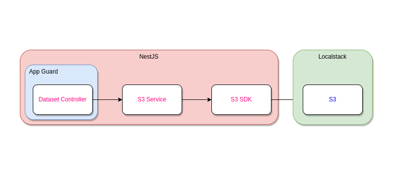
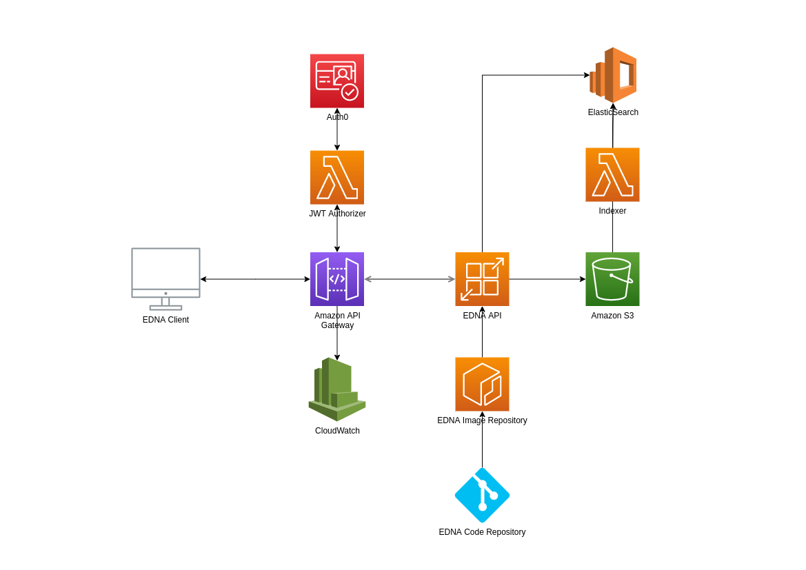

# EDNA

Training dataset management API


## Features

- Data upload/download/delete
- Data labeling

## Prerequisites

- Docker
- docker-compose

## Running the application

```
$ docker-compose up api
```

Navigate your browser to: http://localhost:3000/

## Swagger documentation

Swagger docs available at: http://localhost:3000/api

## Running tests

### Unit tests

```
$ docker-compose run api npm run test
```

### End-to-end tests

```
$ docker-compose up api npm run test:e2e
```

*Requires localstack to be up

## Tech Stack



## Deployment infrastructure



- **Auth0** - Issues JWT to authenticated users / applications
- **API Gateway** - Secures the API by verifying the JWT and provides throttling and rate-limiting
- **App Runner / ECS** - container orchestration and hosting for our API
- **ECR** - container image repository
- **S3** - data + label storage
- **ElasticSearch/Mongo/Postgres** - image indexing/searching
- **CloudWatch** - API activity logging

As it centers around blob storage, S3 pretty much powers the essential features of this API. Incidentally, S3 also support object tagging, which we will use to full effect. We will offload uploads and downloads to S3 using pre-signed URLs, allowing the consumer to upload directly to S3. This should be faster for the client and we avoid having to maintain TCP connections and buffer streams in our API container.  

Securing the API can be configured using API Gateway. API Gateway can verify the JWT token before decoding and passing it along to our API. We can implement user activity logging simply by hooking up API Gateway to Cloudwatch. Alternatively, as the JWT token is available to our API, we can extract user information and apply application-specific restrictions.

To power search functionality, we can leverage ElasticSearch or some other database (RDS, MongoDB) to store indexes. We'd like S3 to remain the single source of truth. Lambda triggers allow us to be notified of any S3 activities / changes especially so that uploads are direct.

## Continuous deployment

All endpoint implementations are stateless and fast allowing for zero downtime between deployments. When a new image is built, new container instances can be launched and any new requests are routed to the new instances. Old instances can be retired when they have no more requests in-flight. This should happen fairly quickly since we're not handling and buffering uploads.

## Limitations

- The API is secured via a rudimentary env var-defined app token. This really should be replaced by the API gateway.
- Deleting a non-empty dataset will throw an error. This is mostly due to how S3 buckets work and the limitations of the AWS Javascript SDK. We could either:
  - rework to use one bucket for all datasets, but we would lose the ability to mount specific datasets for training (using S3 bucket mounts)
  - recursively delete objects, but this can take a long time
  - use AWS S3 CLI, which is crude
  - use object lifecycle, but deletion would be asynchronous
- The tests aren't exhaustive and need more love

## Potential feature enhancements

- Async upload confirmation / error handling
- Thumbnail / Preview generation
- Multipart upload for large files

